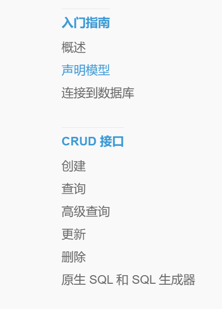

# 后端培养方案

## 任务要求

## 前言

- 代码风格参考（大概看看就行）：Google 发布的《Go 代码规范》( [01 Overview | Google Style Guides (gocn.github.io)](https://gocn.github.io/styleguide/docs/01-overview/))
- 该方案并不需要你学习的多深入，里面的大概了解基础就行，到有需求时能知道有这么个东西，能去找出来用（但个人有时间时可以对提到的内容加深、扩展，更之后的时间参考扩展内容）

> 有些英文文档可以使用浏览器翻译配合着看，推荐翻译插件：[沉浸式翻译](https://immersivetranslate.com/)：最受欢迎的双语对照网页翻译插件

## 第一周

### 作业：memory todolist

数据在内存中的 todolist

- 实现  **增删改查**  4 个接口
  - 请自行设计路由，学习 RESTful API，参考：\<[https://www.ruanyifeng.com/blog/2014/05/restful\_api.html](https://www.ruanyifeng.com/blog/2014/05/restful_api.html)\>
- 使用 curl 进行测试
  - 注意保留测试的 curl 脚本及结果，一并上传到代码仓库中
    - 学习 curl 基本使用，并尝试在终端发出 HTTP 请求，例如 `curl -X GET [http://127.0.0.1:8080/ping`](<http://127.0.0.1:8080/ping%60>), 和上面直接在浏览器访问应该能得到相同结果
    - 至于 curl 如何发送 POST 等其他请求方法，如何添加 form，json 等参数请自行搜索文档（熟练使用搜索引擎是程序员的必备技能）
  - 也可以使用 apifox，postman 进行测试，使用更加方便

- 学习 git 的基本操作（如 pull,push）
  - **！建议周六周日做完就先注册 **** github ****，并把这个 **** TODO list  **提交到代码仓库（可参考：** [github](https://blog.csdn.net/gentleman_hua/article/details/123816150?spm=1001.2014.3001.5506)提交 pr\_提交 pr 是什么意思\_@才华有限公司的博客-CSDN 博客 **）**
  - **forks 学习↓**
  - **<http://doc.yonyoucloud.com/doc/wiki/project/github-basics/fork-example-repo.html>**
  - **forks**  **被用于去更改别人的项目（贡献代码给已经开源的项目）或者使用别人的项目作为你自己想法的初始开发点。**

### 学习任务

- 搭建 go 语言开发环境
- 学习 go 语言基础知识（推荐《 [Go 编程语言指南》](https://tour.go-zh.org/welcome/1)）
  - 基础语法，循环，函数，变量常量定义、结构体，方法，指针，map，数组
  - 了解 go mod，管理第三方依赖，package，导入导出，可见性等
- 学习 go 语言后端框架 gin
  - 成功运行 gin 服务，参考：\<[https://gin-gonic.com/zh-cn/docs/quickstart/](https://gin-gonic.com/zh-cn/docs/quickstart/)\>
  - 尝试浏览器访问 [http://127.0.0.1:8080/ping](http://127.0.0.1:8080/ping)
  - 学习 gin 路由配置，GET，POST，UPDATE，DELETE
  - 了解三种类型参数的获取方法（path，form，json），并实现自动的 **参数校验** 和 **参数绑定**
    - 参考：\<[https://gin-gonic.com/zh-cn/docs/examples/binding-and-validation/](https://gin-gonic.com/zh-cn/docs/examples/binding-and-validation/)\>

## 第二周

### 作业：db todolist

数据存储在数据库中的 todolist

- 实战练习
  - [创建数据表](https://gorm.io/zh\_CN/docs/migration.html)
  - 推荐使用 [[gorm.Model](http://gorm.Model/)]

<https://gorm.io/zh\_CN/docs/models.html#gorm-Model>，

参考 [go 嵌入结构体]

([https://gorm.io/zh\_CN/docs/models.html#%E5%B5%8C%E5%85%A5%E7%BB%93%E6%9E%84%E4%BD%93](https://gorm.io/zh_CN/docs/models.html#%E5%B5%8C%E5%85%A5%E7%BB%93%E6%9E%84%E4%BD%93)) （也顺便了解 go 的面向对象写法）

- 根据需要添加其他各种数据类型的字段，int，string，bool，日期等
- 为之前的 demo 添加数据库支持
- 为之前的 demo 添加分页查询 API

### 学习任务

- 安装配置 sqlite 或者 mysql 数据库（推荐使用 sqlite，简单）
- 学习数据库基本知识 (sql 基础语法)
- 学习 gorm 参考：\<[https://gorm.io/zh\_CN/docs/index.html](https://gorm.io/zh_CN/docs/index.html)\>，了解如何使用 go 语言操作数据库，包括
  - 数据表的创建
  - 对数据的增删改查操作

## 扩展（grpc）

### 作业：rpc todolist

基于 rpc 的 todolist

- 将之前写的 demo 用 rpc 框架（grpc）实现，并使用客户端向服务端调用接口 (不需要全写，实现一个接口，意思意思就行)

### 学习任务

- 参考[Quick start | Go | gRPC --- 快速入门 |前往 |gRPC 的](https://grpc.io/docs/languages/go/quickstart/)（英文，官方）
- 中文可参考[GRPC 简介 - 知乎 (zhihu.com)](https://zhuanlan.zhihu.com/p/411315625) 和 [GO-GRPC 使用教程 - 知乎 (zhihu.com)](https://zhuanlan.zhihu.com/p/411317961)（简短但该有的基本都有）

- Proto 使用
  - 怎么编写 proto 文件
  - 怎么使用 protobuf 将 proto 文件转为 go 代码
  - 怎么调用其他 proto 文件里的定义

- Grpc 服务

  - 怎么创建 grpc 的客户端、服务端并使其能正常交互

## 作业

当你完成了上述任务后，需要将代码提交至 github 仓库

你需要：

- 学习 git 的基本使用
- 了解 fork，如何通过 PR 提交代码
- 访问 \<[**GitHub Dashboard --- GitHub**](https://github.com/dashboard)\> 创建 github 账号，@我，我会给你相关仓库的访问权限
  - 记得给 github 加个昵称（下图的自定义名称处）
- 提交 PR，我会审核代码

🎉 最后就是正式参与项目开发啦 🎉

## 附录

### 资料

| [官方教程](https://tour.go-zh.org/) | 官方教程，简单易懂 |
| --- | --- |
| [Go 入门指南](https://go.wuhaolin.cn/the-way-to-go/) | |
| [C 语言中文网的 Go 教程](http://c.biancheng.net/golang/) | 除了部分内容付费外也挺好的 |
| [菜鸟教程](https://www.runoob.com/go/go-tutorial.html) | 可以看，稍微有点过时 |
| [微软提供的教程](https://learn.microsoft.com/zh-cn/training/paths/go-first-steps/) | 评价不错 |
| [Go 语言圣经](https://go.wuhaolin.cn/gopl/) | |
| [Go Web 编程](https://go.wuhaolin.cn/build-web-application-with-golang/) |
| [Go 语言高级编程](https://go.wuhaolin.cn/advanced-go-programming-book/) | 内容更多更细，例子也更多 |
| [go 语言设计与实现](https://draveness.me/golang/) | 语言的实现，进阶材料 |
| [RPC](http://books.studygolang.com/go-rpc-programming-guide/) | |

### 拓展内容（可在之后的学习中慢慢看，不在两周要求内）

- 了解 python
- 了解 Redis

- 了解消息队列 例如 Rabbitmq
- 了解 Elasticsearch
- 了解 日志，监控 prometheus，grafana

- 了解 nginx
- 了解 环境变量
- 了解 Bash 脚本
- 了解 Makefile
- http/rpc协议
