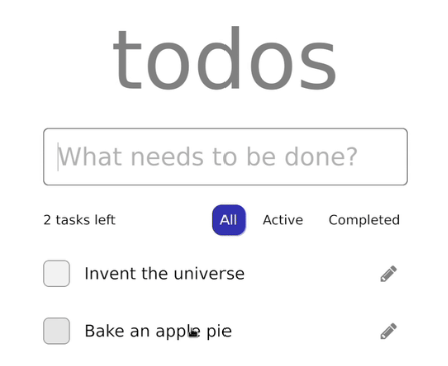

# 前端学习路线

## 第一周

### 作业

实现一个待做清单 app

### 学习路线

- HTML 标签:,
,
,<a>, ,<form>等（不用记，尽量每个标签都试着写一下即可）
- CSS
  - 引入 CSS 方法
  - 常见 CSS 属性：颜色，背景色，字体大小等
  - id, class 选择器
  - 盒子模型
  - 定位
  - 布局

> HTML 和 CSS 可以跟着网上任意教程练练手，但不建议也不需要花过多时间。新手做项目时可在 w3school 速查，链接：w3school 在线教程。

- JavaScript
  - 学习基础语法 (变量声明，for 循环，if 语句，函数等)
  - 使用 js 代码操作 (创建，销毁，修改等) html 标签的一系列 DOM 操作 API
  - ES6 基础 const, let, map 解构等
  - 事件冒泡
  - Promise | Async/Await
- Ajax 请求（用于前后端分离，数据交互）：建议只学习其中的 fetch 方法即可
- Git
  - 注册 GitHub/Gitee 账号，新建远程仓库
  - 了解常用命令：add、status、commit、merge、push、stash、fetch（可在项目中逐渐熟悉）

## 第二周

### 作业

使用 React/NextJS 重新实现待做清单 app

### 学习路线

- 安装 Node.js 和 Npm，学习基础命令即可。
- Typescript（是 js 的超集，语法有些许改变）
- React 技术栈：官方学习文档链接：Quick Start – React（需翻墙），翻不了墙看网上的教学视频也可以但不推荐，常用必学函数：useEffect,useState,useCallback。
- [Next.js](https://www.nextjs.cn/learn/basics/create-nextjs-app)（本质上是 React），重点学习其中的 next/router
    链接：https://www.nextjs.cn/learn/basics/create-nextjs-app
- [Material UI 组件库](https://mui.com/)：（项目过程中随用随学，但要提前浏览每个组件样式效果等）

## 附录

### 拓展

前端需要学习的一些很重要的底层原理：

- 事件循环
- 浏览器渲染原理

这两个知识对代码优化和解决问题有很大的帮助